# Projeto Pipelene de Dados

### INTELIGÊNCIA ARTIFICIAL APLICADA - MODULO 02
### Professores: Otávio Calaça Xavier, Sirlon e Alexandre
### Alunos:
### Afrain da Silva Calixto
### Flávio Lourenço da Silva
### Gustavo Adolpho Souteras Barbosa

## Arquitetura do Projeto Cloud


## Fluxo de execução

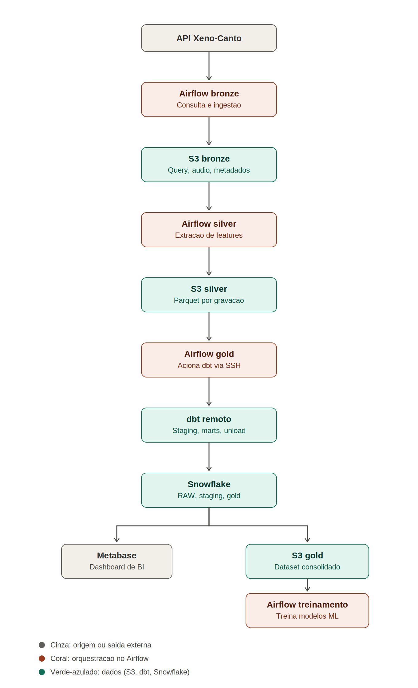

## Origem dos dados

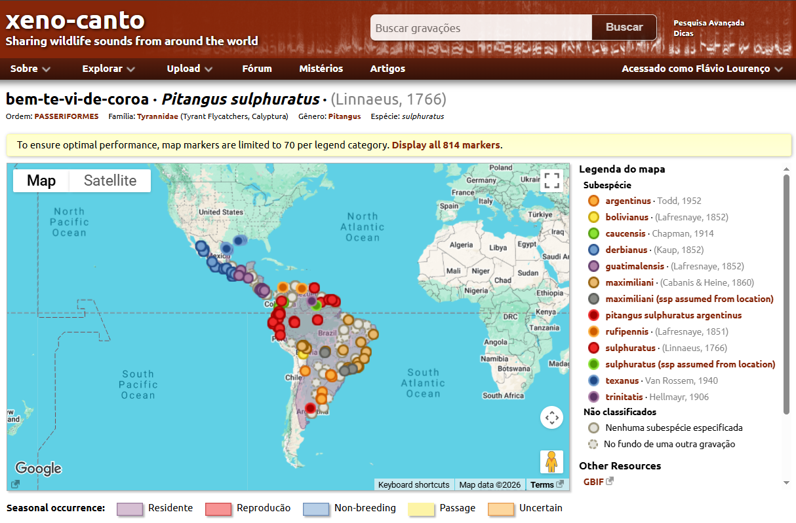

```bash
https://xeno-canto.org/explore/api
```

## S3

Pastas S3

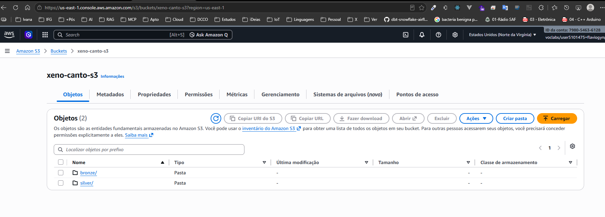

Camada Bronze

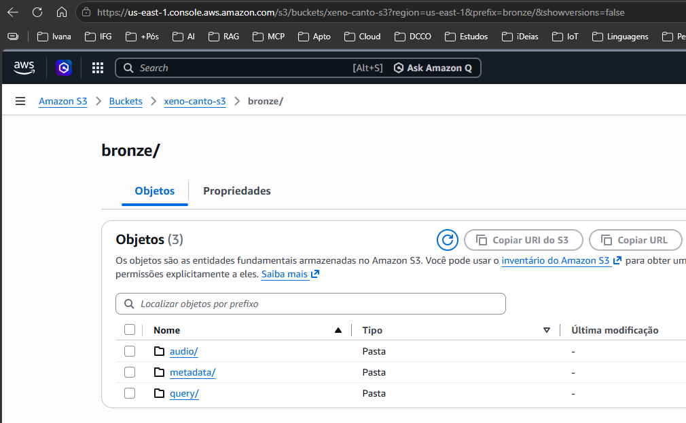

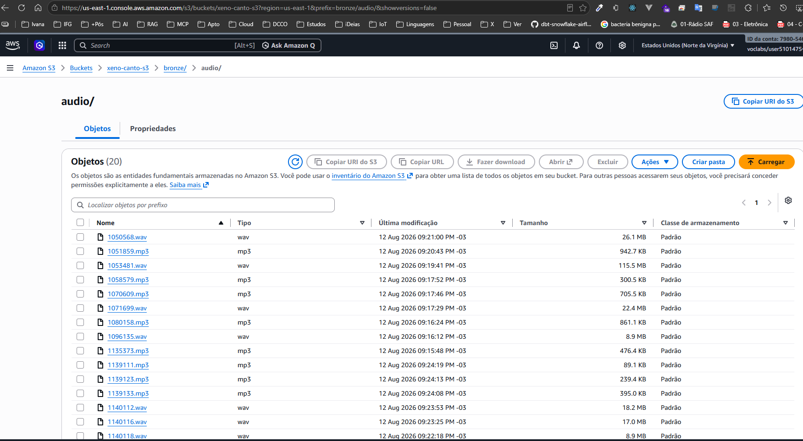

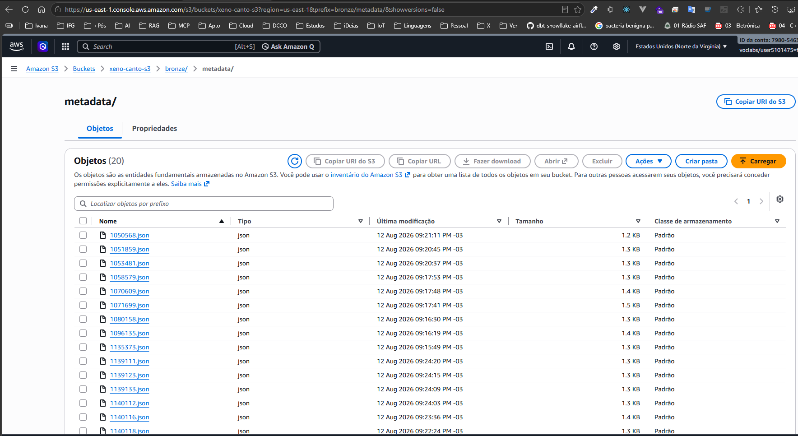

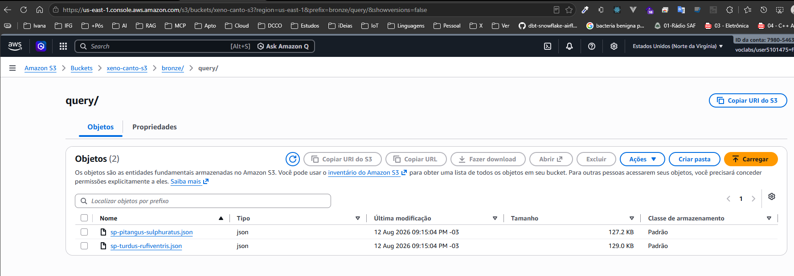

Camada Silver

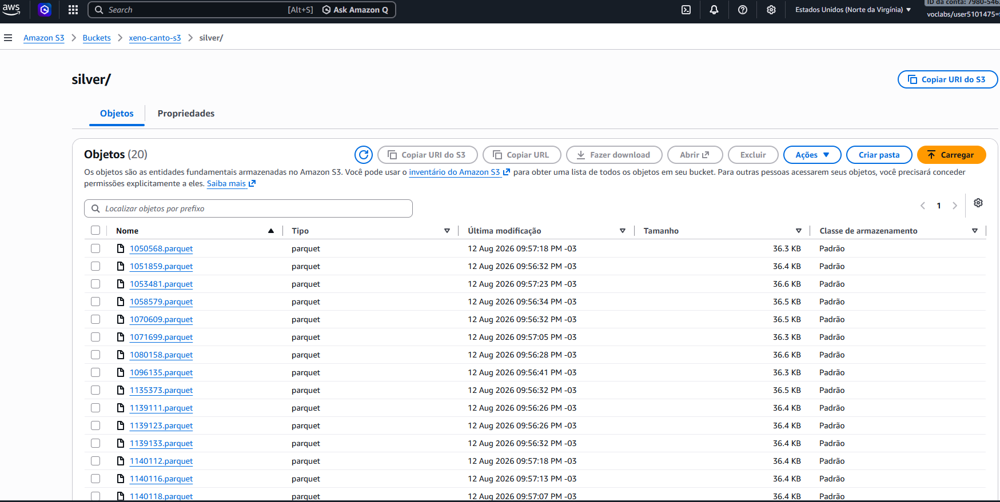

Camada Gold
 
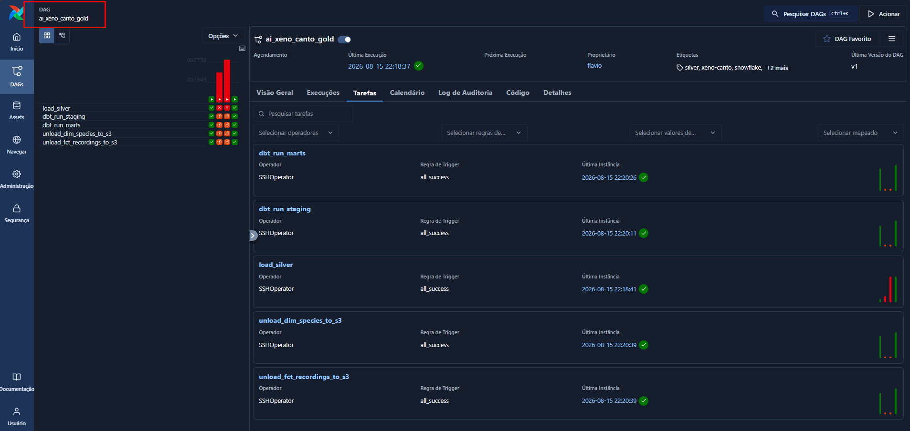

Camada Treinamento


## Snowflake

Setup de inicial 

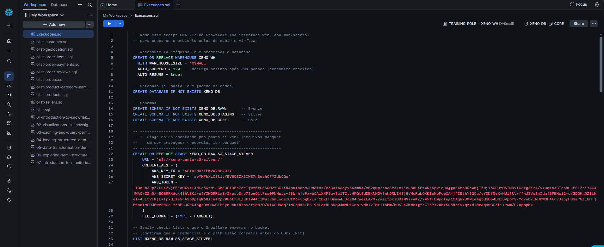

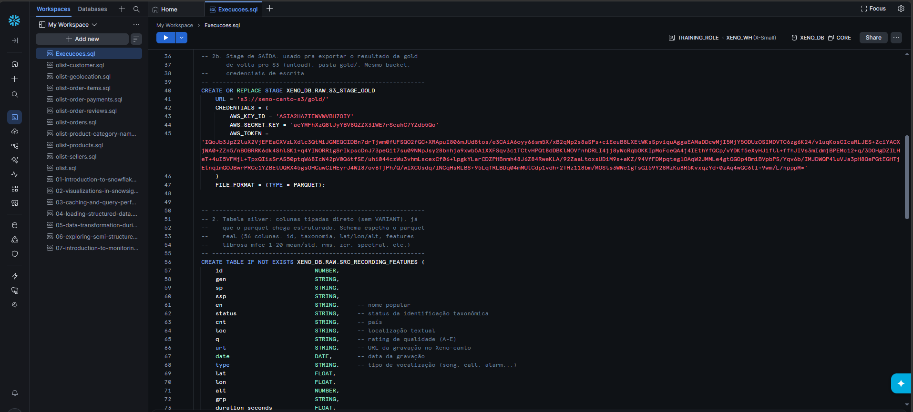

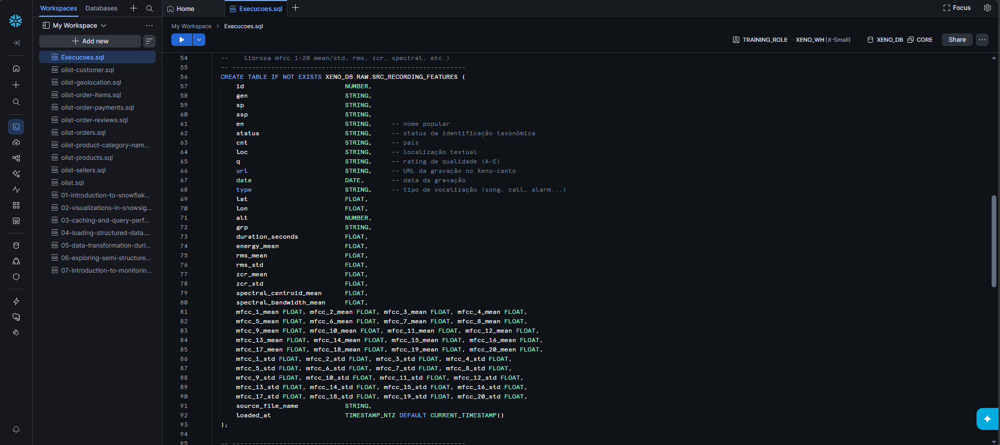

## Execuções Airflow

ai_xeno_canto_bronze

ai_xeno_canto_silver

ai_xeno_canto_gold

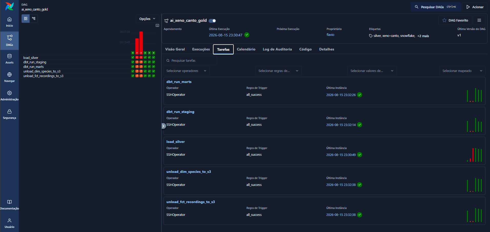

ai_xeno_canto_treinamento


