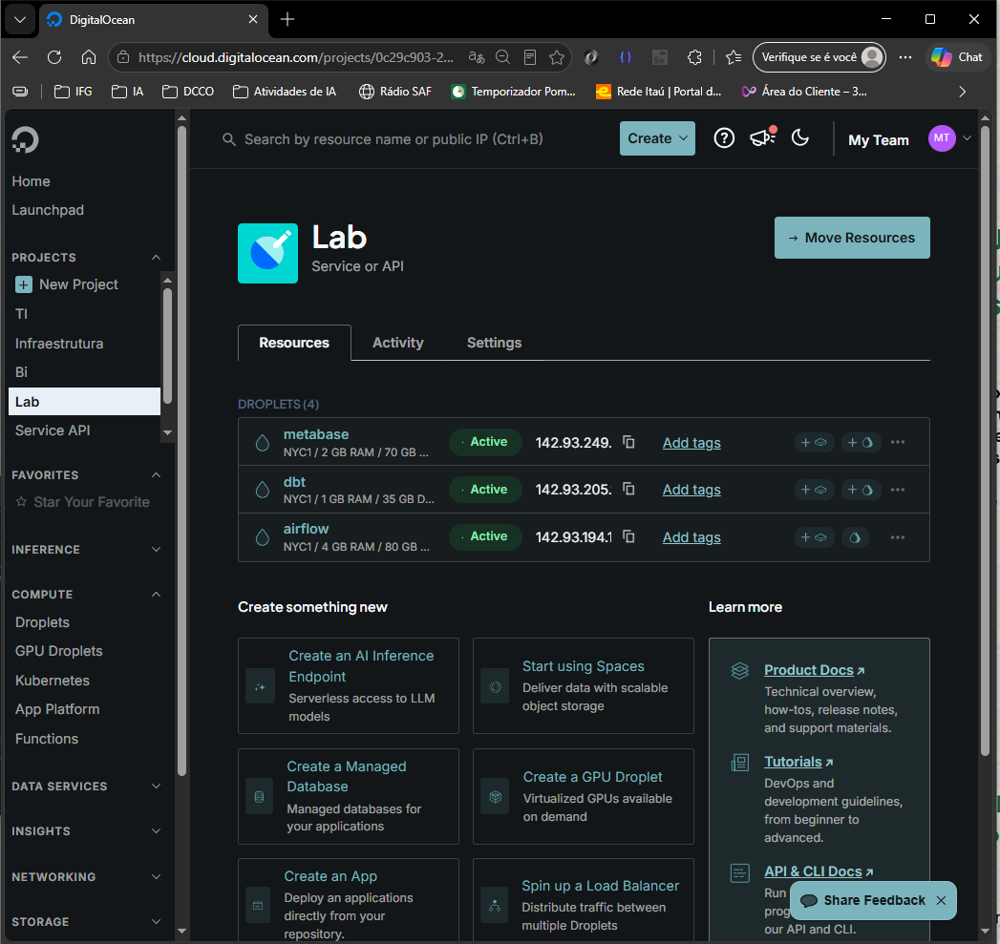

# Projeto Pipelene de Dados

### INTELIGÊNCIA ARTIFICIAL APLICADA - MODULO 02
### Professores: Otávio Calaça Xavier, Sirlon e Alexandre
### Alunos:
### Afrain da Silva Calixto
### Flávio Lourenço da Silva
### Gustavo Adolpho Souteras Barbosa

## O que falta

- Conector para o dbt para usar no airflow
- Transformar as dags em funções Python
- Adicionar mais testes

## Arquitetura Cloud do Projeto

