# Projeto Pipelene de Dados

```text
INTELIGÊNCIA ARTIFICIAL APLICADA - MODULO 02
Professores Dr: Otávio Calaça, Sirlon Diniz e Rafael Gomes
Alunos:
  Afrain da Silva Calixto
  Flávio Lourenço da Silva
  Gustavo Adolpho Souteras Barbosa
```

## Arquitetura do Projeto Cloud


## Fluxo de execução


## Origem dos dados


```bash
https://xeno-canto.org/explore/api
```

## S3

Folders do S3

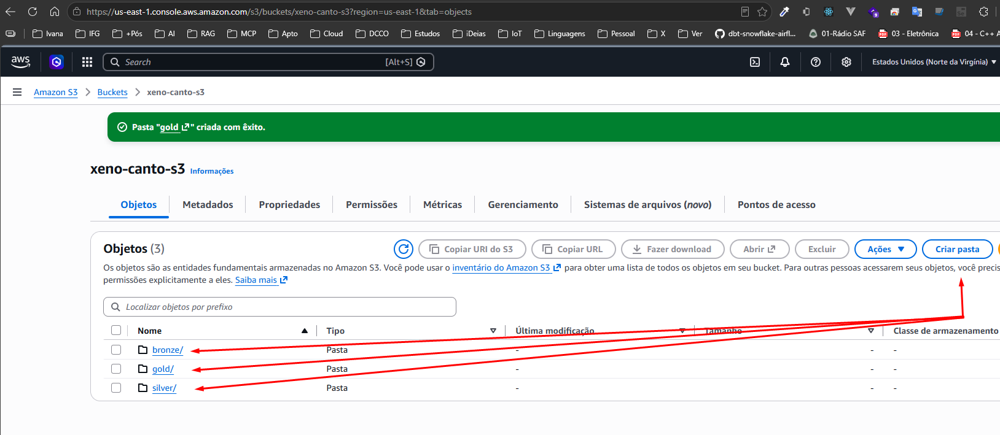

Folder Bronze/


Folder Silver/


Folder Gold/
 
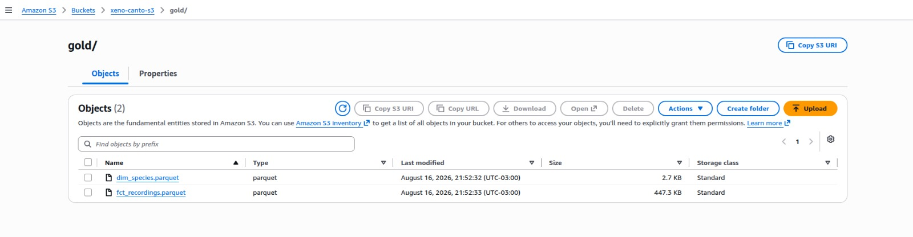

Folder Treinamentos/

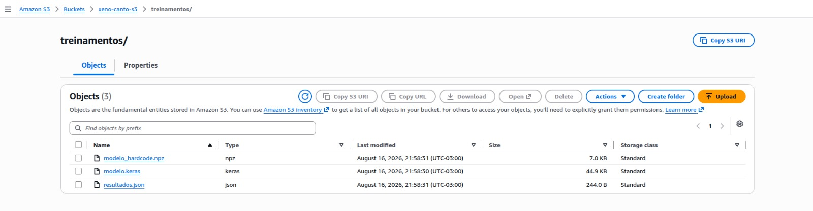

## Snowflake

Setup de inicial SQL


## Dbt

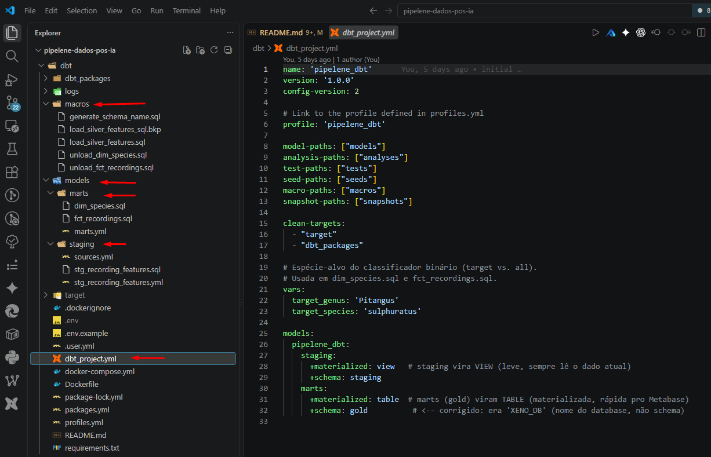


## Execuções Airflow

ai_xeno_canto_bronze

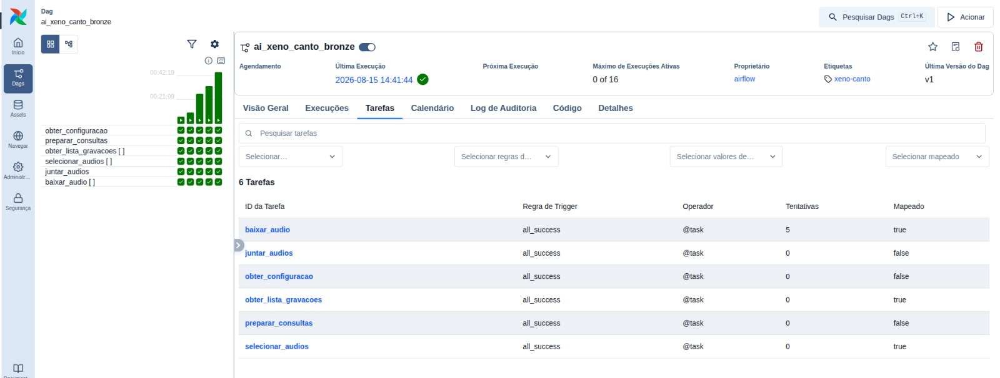


ai_xeno_canto_silver

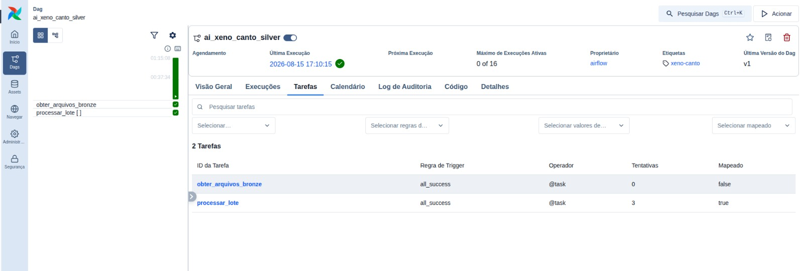

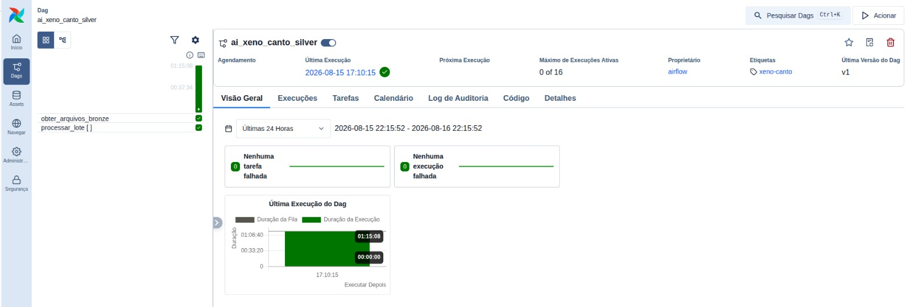

ai_xeno_canto_gold (ssh)


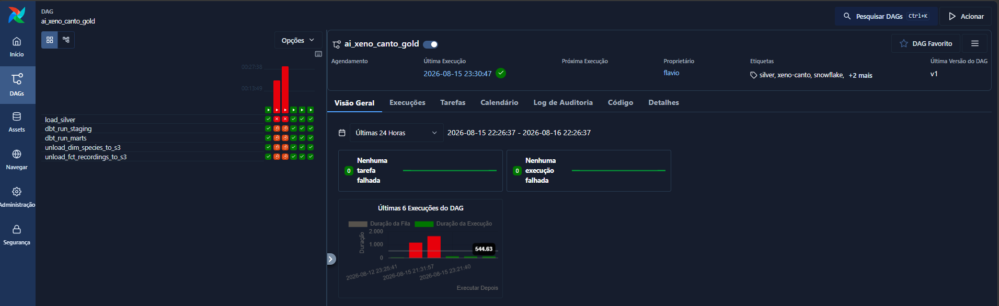

ai_xeno_canto_treinamento

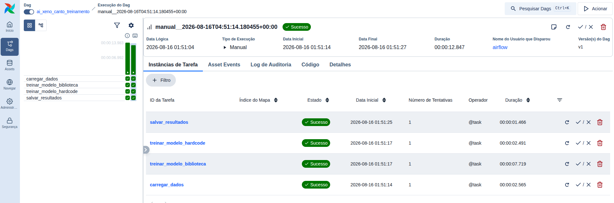

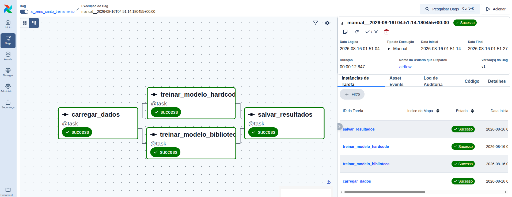

## Metabase

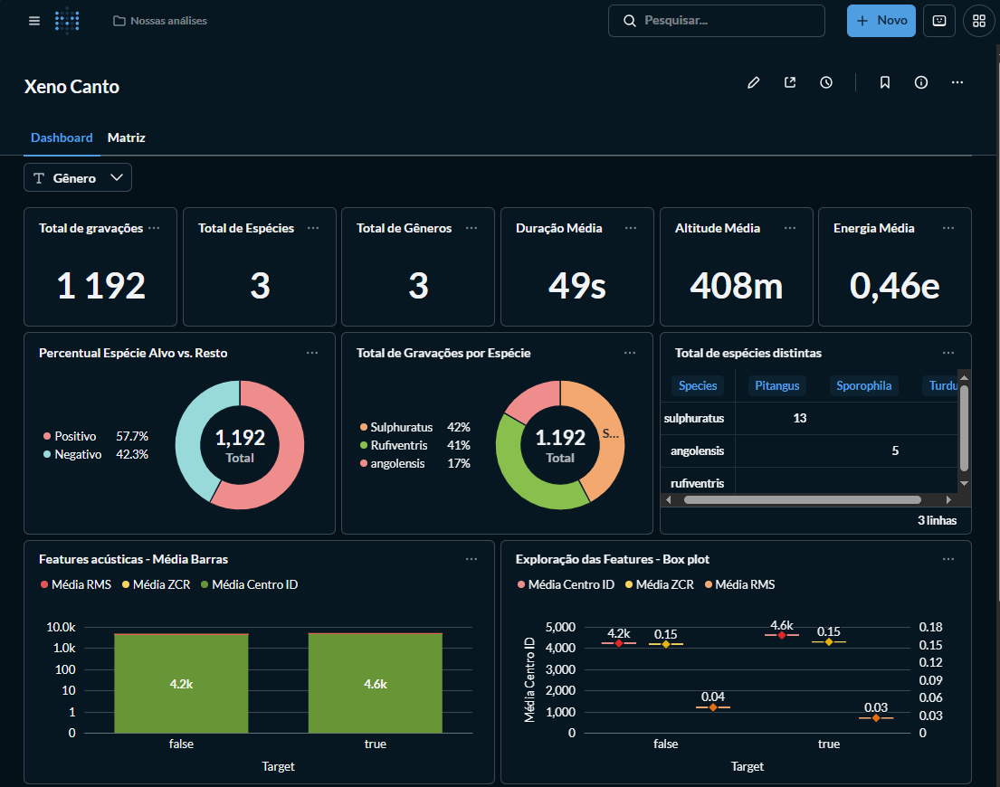

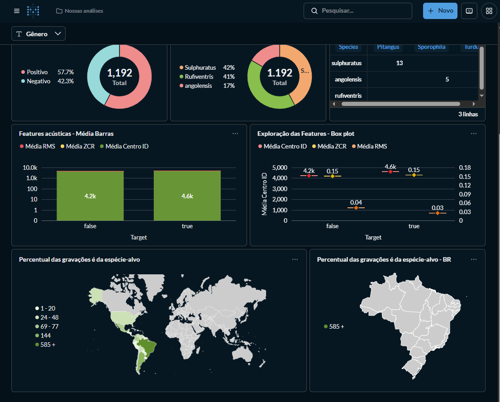

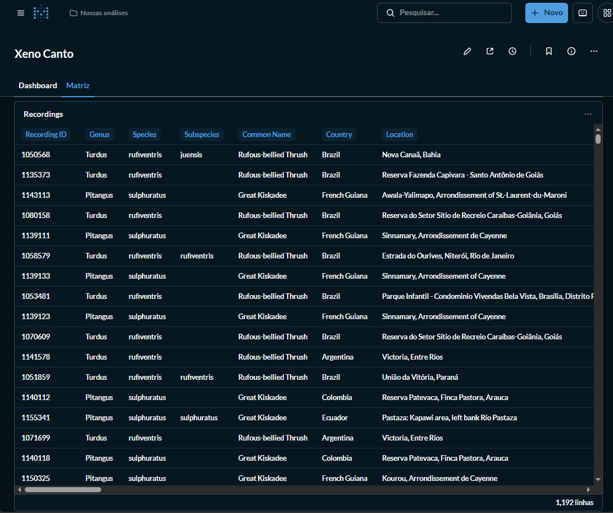

