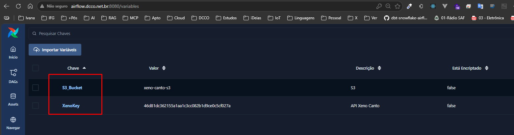
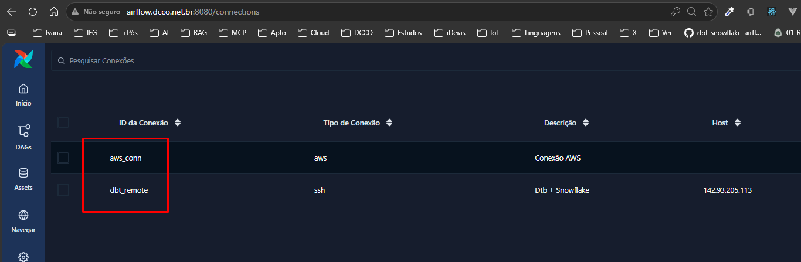
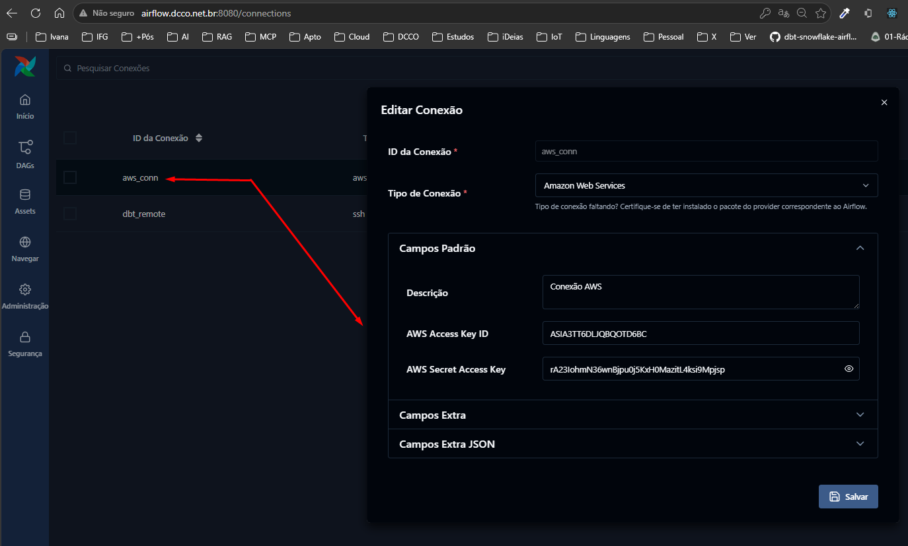
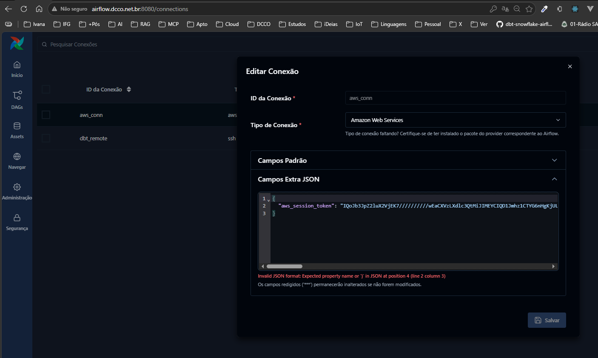

# Instalação do Airflow em uma droplet da DigitalOcean (usuário root)

## IP Cloud

```text
142.93.194.1
```

Este arquivo reúne os passos para subir o Airflow usando o arquivo de compose já disponibilizado neste projeto. Não é necessário alterar o arquivo docker-compose.yml.

## 1. Atualizar o sistema

```bash
apt update && apt upgrade -y
```

## 2. Instalar Docker e Docker Compose

```bash
apt install -y ca-certificates curl gnupg lsb-release
install -m 0755 -d /etc/apt/keyrings
curl -fsSL https://download.docker.com/linux/ubuntu/gpg | gpg --dearmor -o /etc/apt/keyrings/docker.gpg
chmod a+r /etc/apt/keyrings/docker.gpg

echo "deb [arch=$(dpkg --print-architecture) signed-by=/etc/apt/keyrings/docker.gpg] https://download.docker.com/linux/ubuntu $(. /etc/os-release && echo "$VERSION_CODENAME") stable" > /etc/apt/sources.list.d/docker.list

apt update
apt install -y docker-ce docker-ce-cli containerd.io docker-buildx-plugin docker-compose-plugin
systemctl enable --now docker
```

## 3. Entrar no diretório do projeto

```bash
cd /root
```

## 4. Criar diretórios necessários

```bash
mkdir -p dags logs plugins config
```

## 5. Criar o arquivo .env

Defina o usuário do container como root e gere segredos válidos para o Airflow.

```bash
JWT_SECRET="$(openssl rand -hex 32)"
FERNET_KEY="$(docker run --rm apache/airflow:3.1.1 python -c 'from cryptography.fernet import Fernet; print(Fernet.generate_key().decode())')"

cat > .env <<EOF
AIRFLOW_UID=0
AIRFLOW__API_AUTH__JWT_SECRET=${JWT_SECRET}
AIRFLOW__CORE__FERNET_KEY=${FERNET_KEY}
_PIP_ADDITIONAL_REQUIREMENTS=
EOF
```

## 6. Inicializar o Airflow

Como este projeto usa uma imagem customizada para incluir dependencias Python
do Airflow, construa a imagem antes de inicializar:

```bash
docker compose build
```

```bash
docker compose up airflow-init
```

## 7. Subir os serviços

```bash
docker compose up -d
```

Se os DAGs de exemplo aparecerem mesmo com `AIRFLOW__CORE__LOAD_EXAMPLES=false`,
o metastore provavelmente já foi inicializado antes com examples ligados. Em uma
instalação nova, remova também os volumes e inicialize novamente:

```bash
docker compose down --volumes --remove-orphans
docker compose up airflow-init
docker compose up -d
```

## 8. Verificar os containers

```bash
docker ps
```

## 9. Acessar a interface web

A interface do Airflow ficará disponível em:

```bash
http://SEU_IP_PUBLICO:8080
```

Usuário e senha padrão:

```text
username: airflow
password: airflow
```

## 10. Verificar o funcionamento

```bash
docker compose logs -f airflow-scheduler
```

Se quiser testar o worker manualmente:

```bash
docker compose run --rm airflow-worker airflow info
```

## 11. Criando SSH entre as VPS

1. SSH entre os droplets — o Airflow precisa conseguir logar no droplet do dbt via chave SSH, do mesmo jeito que você já fez do seu computador local pro Metabase, só que agora é droplet-pra-droplet:
bash# gerar uma chave dedicada no droplet do Airflow (não reuse sua chave pessoal)

```bash
ssh-keygen -t ed25519 -f ~/.ssh/airflow_to_dbt -N ""
```

Copiar a chave pública para o droplet do dbt

```bash
ssh-copy-id -i ~/.ssh/airflow_to_dbt.pub root@IP_DO_DROPLET_B
```

Inserir manual a chave airflow_to_dbt.pub no arquivo authorized_keys

```bash
vim authorized_keys
```

2. Cloud Firewall — libere a porta 22 no droplet B, mas restrinja a origem ao IP do droplet do Airflow (não 0.0.0.0/0). Isso é a mesma pegadinha que vocês já pegaram com o Metabase: Cloud Firewall da DigitalOcean é separado do UFW, então precisa configurar os dois (ou pelo menos o Cloud Firewall).

Dica: se os dois droplets estiverem na mesma região, ative uma VPC entre eles — tráfego fica na rede privada (mais seguro, sem custo de banda, e você pode restringir o SSH só à rede interna).

3. Provider SSH no Airflow — instale o pacote (se ainda não tiver):

```bash
bashpip install apache-airflow-providers-ssh
```

4. Connection no Airflow — Admin → Connections → nova conexão tipo SSH:

Host: IP do droplet B
Username: o usuário SSH
Extra: {"key_file": "/caminho/da/chave/airflow_to_dbt"} (ou cole a chave privada direto, se preferir)

```text
{
  "key_file": "/home/airflow/.ssh/airflow_to_dbt",
  "no_host_key_check": true
}
```

5. Task no DAG — usar SSHOperator chamando o docker compose run remotamente:

```bash
pythonfrom airflow.providers.ssh.operators.ssh import SSHOperator
```

```bash
run_dbt = SSHOperator(
    task_id="run_dbt",
    ssh_conn_id="dbt_remote",
    command=(
        "cd /root/dbt && "
        "docker compose run --rm dbt run --target dev_snowflake && "
        "docker compose run --rm dbt test --target dev_snowflake"
    ),
    cmd_timeout=600,
)
```

6. Atualizar arquivos do Docker (parar e subir novamente)

```bash
local$ scp ./pipelene-dados-pos-ia/airflow/docker-compose.yml root@<IP_REMOTO>:/root
```

```bash
docker compose down --remove-orphans
docker compose up -d --build
docker compose ps
```

A vantagem de fazer assim: o Airflow dispara o dbt remotamente no droplet responsavel pelas transformacoes e espera o codigo de saida. A conexao com o Snowflake continua isolada no projeto dbt.

7. Desativa exemplos de Dags

```bash
export AIRFLOW__CORE__LOAD_EXAMPLES=False
```

### Sob serviços por demanda

Exemplo: Worker, sem parar os outros containers

```bash
docker compose up -d airflow-worker
```

### Variáveis



### Conexões







8. Dependencias Python do Airflow

As bibliotecas Python usadas pelas DAGs devem ser adicionadas em
`requirements.txt` e instaladas via imagem customizada:

```bash
docker compose build
docker compose up -d
```
