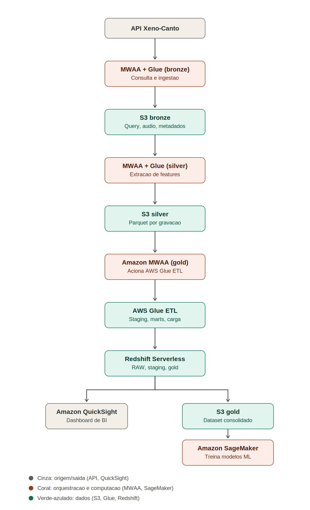

# Soluções AWS para substituir cada componente do pipeline

Antes de gerar o diagrama, seguem as tecnologias AWS que substituiriam cada peça do stack atual (Airflow, dbt, Snowflake, Metabase), mantendo S3 como já é:

## Amazon MWAA (Managed Workflows for Apache Airflow)

Serviço gerenciado que roda o próprio Apache Airflow, então as DAGs que você já escreveu continuam praticamente as mesmas — só troca a infraestrutura (containers Docker Compose em droplets) pelo ambiente gerenciado da AWS, que já cuida de scheduler, workers e alta disponibilidade.

## AWS Glue (Python Shell Jobs)

Substitui os scripts Python que hoje rodam dentro dos containers Airflow para consultar a API Xeno-Canto e extrair features com librosa. São jobs serverless, cobrados por tempo de execução, sem precisar gerenciar servidor.

## Amazon S3

Continua exatamente como está — já é uma solução AWS nativa para as três camadas (bronze, silver, gold).

## AWS Glue ETL (Spark)

Substitui o dbt. Em vez de modelos SQL rodando via SSHOperator num droplet remoto, as transformações (staging → marts) rodam como jobs Spark gerenciados pela AWS, com o Glue Data Catalog cuidando do catálogo de metadados/schemas.

## Amazon Redshift Serverless

Substitui o Snowflake como data warehouse. Guarda as tabelas RAW, staging e gold, com cobrança por capacidade computacional usada (RPU-hora), sem precisar gerenciar cluster fixo.

## Amazon SageMaker

Substitui os scripts de treinamento rodando dentro do Airflow. Os jobs de treino (baseline hard-coded e o modelo sklearn) rodam como Training Jobs gerenciados, com possibilidade de versionar modelos no Model Registry.

## Amazon QuickSight

Substitui o Metabase para os dashboards — BI nativo da AWS, com conexão direta ao Redshift.

## AWS IAM + CloudFormation

Permissões entre os serviços e toda a infraestrutura documentada como código — isso você já usa hoje para os recursos AWS existentes (S3, credenciais), só expande para cobrir os novos serviços.

## Fluxo AWS

