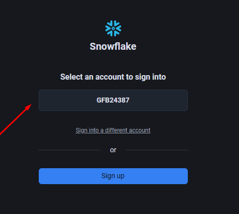
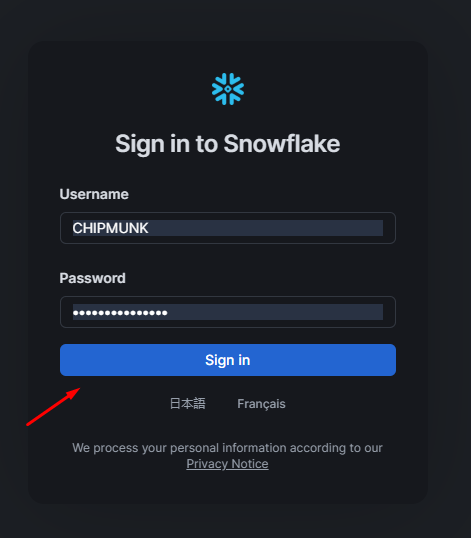
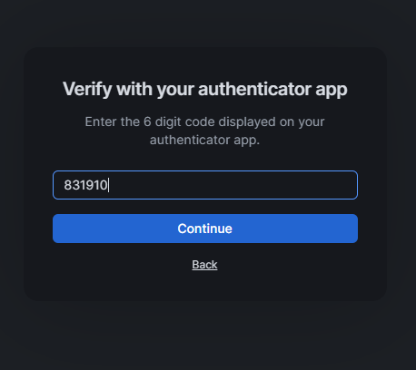
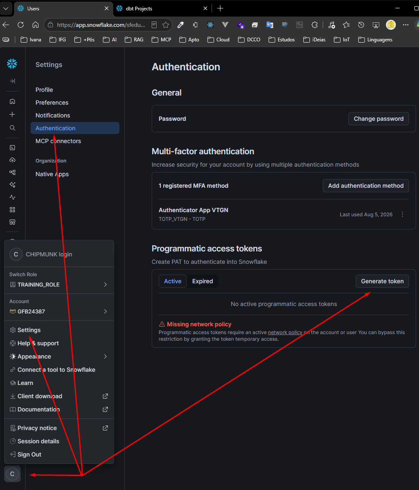
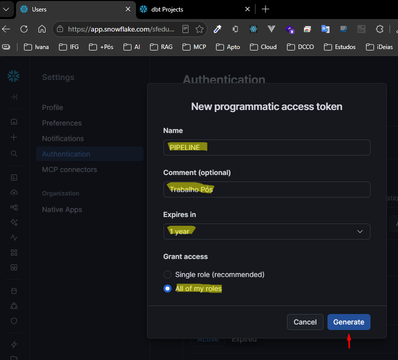
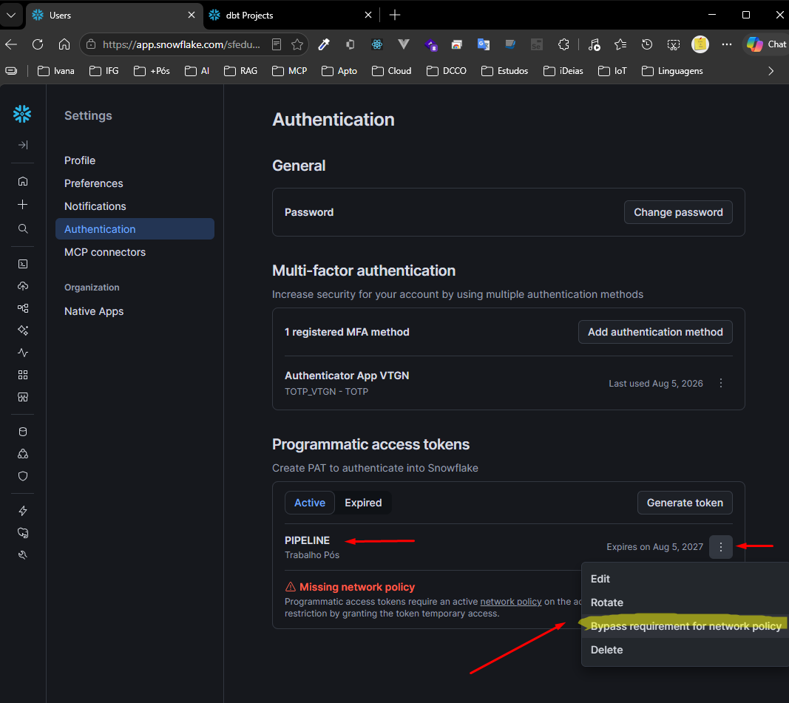
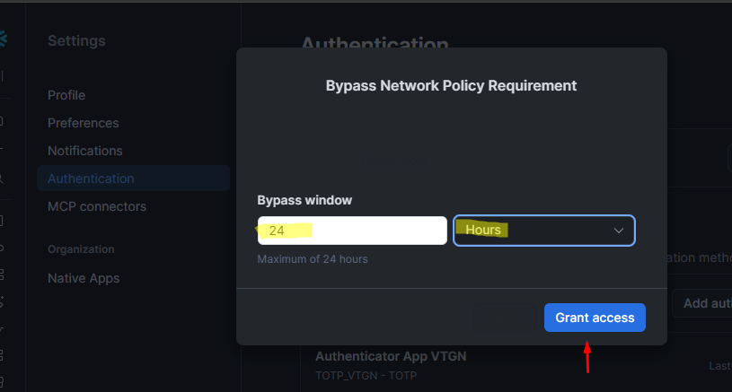

# Snowflake

## Acesso

```text
https://app.snowflake.com/
```

## Escolha o usuário da Aula do Otávio





## Autenticador instalado App Android 



## Authentication

Para obter ou validar as credenciais do Snowflake, acesse a página de autenticação do console:
🔗 [Configurações de Autenticação - Snowflake](https://app.snowflake.com/sfedu02/gfb24387/settings/authentication)



### Cria tokem de acesso



### Selecione a opção Bypass requirement




